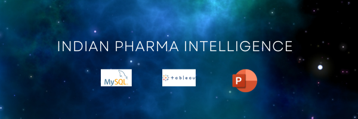

  

# Pharma Market Analytics – India

This project presents a detailed analysis of Indian pharmaceutical sales and drug pricing data. The goal is to identify top-performing products, explore pricing patterns, and uncover market-level insights using Excel, SQL, and visualization tools.

---

## Objective

To analyze pharma datasets and extract business insights to support better decision-making in drug performance, pricing strategies, and market segmentation. This case study demonstrates a real-world approach to business and data analytics using structured medical data.

---

## Tools Used
- SQL – data querying and transformation
- Power BI / Tableau – visual storytelling and reporting
- Canva – final report and banner design

---

## Data Sources

Raw datasets were collected from:

- Kaggle: [A-Z Medicine Dataset of India](https://www.kaggle.com/datasets/shudhanshusingh/az-medicine-dataset-of-india)
- GitHub: [Indian Medicine Dataset by junioralive](https://github.com/junioralive/Indian-Medicine-Dataset/blob/main/DATA/indian_medicine_data.csv)

---

## Key Files & Project Structure

### 📄 [README.md](./README.md)
📁 Data/
   ├── A_Z_medicines_of_India_RAWDATASET.csv
   ├── A-Z Medicine Dataset cleaned.sql
   ├── Drug_Category_Sales_RAWDATASET.csv
   └── Drug_Category_Sales_cleaned.sql

📁 Visuals/
   ├── Dashboard.png
   ├── Pharma Dashboard.twbx

📄 Final Report: Indian_Pharma_Case_Study_Report.pdf

### 📁 Data Files
- [A_Z_medicines_of_India_RAWDATASET.csv](./A_Z_medicines_of_India_RAWDATASET.csv)
- [A-Z Medicine Dataset cleaned.csv](./A-Z%20Medicine%20Dataset%20cleaned.csv)
- [Drug_Category_Sales_RAWDATASET.csv](./Drug_Category_Sales_RAWDATASET.csv)
- [Drug_Category_Sales_cleaned.csv](./Drug_Category_Sales_cleaned.csv)

This is the original Tableau file used to create the dashboard screenshot.

### 📁 Visuals
- [Dashboard.png](./Dashboard.png)
- [Download Tableau Dashboard (.twbx)](./Pharma_Dashboard_Tableau.twbx)

### 📄 [Final Project.pdf](./Final%20Project.pdf)

---

## Analysis Performed

- Identification of top-selling medicines by revenue and volume
- Price segmentation of medicines by salt, brand, and category
- category-based sales pattern analysis
- Comparison of branded vs. generic pricing
- Insights into multi-salt formulations and sales distribution

---

## Key Insights

- **Paracetamol (N02BE)** and **Anxiolytics (N05B)** were the top-selling drug categories in India between 2014–2019, driven by consistent demand for pain relief and mental health treatment.
- These two categories, along with **Asthma/COPD (R03)** and **Ibuprofen (M01AB)**, accounted for **68% of total unit sales**, indicating a concentrated demand in essential therapeutic areas.
- The **top 10 most expensive medicines** were primarily chronic or specialty drugs offered by multinational brands — focused on low-volume, high-margin strategies.
- **Aceclofenac, Domperidone, and Cefixime** emerged as the most frequently used compositions, indicating dominance in pain, gastrointestinal, and antibiotic therapy.
- The Indian pharma market displays a **strong generic ecosystem**, with multiple brands offering similar formulations, leading to competitive clustering across key categories.

---

## How to Explore This Project

- Click on `.csv` files to view data
- Open `Dashboard.png` for key visuals
- Open `Pharma Dashboard` for detail chart analysis
- Read `Final Project.pdf` for a full case study summary

---

## About the Author

**Ajay Thakran**  
Data Analyst skilled in Excel, SQL, Power BI, Tableau, and Python  
📍 Gurugram, India  
📧 ajaythakran.analyst@gmail.com  
🔗 [LinkedIn](https://shorturl.at/aCbXe)

---

_This project showcases my ability to clean, analyze, and visualize real-world data, and to extract business insights using structured analytics._
